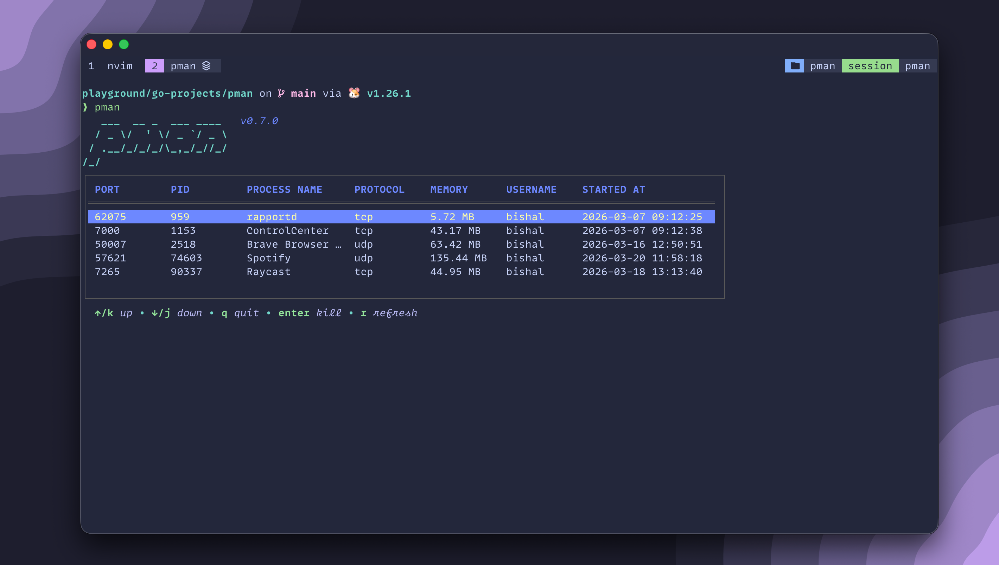

# pman

<p align="center">
  
</p>

A terminal-based process manager with a beautiful TUI for viewing and managing listening network processes.


## Preview



## Features

### TUI Features
- View all processes listening on network ports
- Display PORT, PID, Process Name, Protocol, Memory, Username, and Started At
- Human-readable memory format (KB, MB, GB)
- Auto-refresh every 2 seconds
- Manual refresh with `r`
- Vim-style navigation (`j`/`k` or arrow keys)
- Beautiful color scheme with custom styling
- Kill processes directly from the TUI

### CLI Commands
- `pman` - Launch interactive TUI (default)
- `pman json` - Output process list as JSON
- `pman kill <pid>` - Kill process by PID
- `pman killport <port>` - Kill process listening on a specific port
- `pman version` - Show version information

## Installation

### Using Homebrew (Recommended on macOS)

```bash
brew tap bishalr0y/homebrew-bishalr0y
brew install pman
```

### Using go install

```bash
go install github.com/bishalr0y/pman@latest
```

### From Source

```bash
git clone https://github.com/bishalr0y/pman.git
cd pman
go install ./cmd/...
```

## Usage

### TUI Mode

```bash
pman
```

### Keybindings

| Key | Action |
|-----|--------|
| `↑` / `k` | Move up |
| `↓` / `j` | Move down |
| `Enter` | Kill selected process |
| `r` | Refresh process list |
| `q` / `Esc` / `Ctrl+C` | Quit |

### CLI Examples

```bash
# Output processes as JSON
pman json

# Kill a process by PID
pman kill 1234

# Kill process on a specific port
pman killport 8080
```

## Requirements

- Go 1.25 or later
- macOS or Linux

## License

MIT
